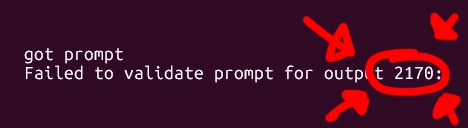
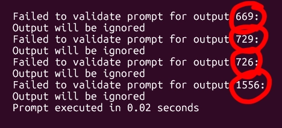
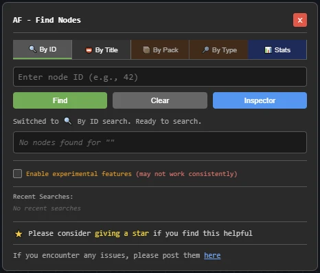

# ComfyUI AF - Find Nodes
A ComfyUI extension that allows you to find and locate nodes by their ID, title, pack, or type in complex workflows.

ComfyUI reports Node-IDs when it encounters errors, but there's no built-in tool to find those Node-IDs quickly. That's now solved with this custom node/tool.

Ever had this in the console? ComfyUI telling you the Node-ID it got stuck on?



Or this:



On a large workflow that means you will be spending a fair amount of time digging around the workflow canvas...

On top of that, Node-ID's are not visible by default. You have to switch them on in the ComfyUI settings.

Well - Here's the solution!



Simply:
1. Open AF - Find Nodes (`Ctrl+Shift+F`)
2. Type `2170` and press Enter
3. Instantly locate the problematic node!
.. Because the AF - Find Nodes extension will zoom in on the node and highlight it.

**Plus** it also let's you reverse engineer the Node-ID by activating the "Inspector", which will display the Node-ID.

The AF - FInd Nodes custom node can find nodes by "ID", "Title", and  has experimental features that might even help you mitigate redundant node packs installed!

Give it a try - you will not be able to live without it!

**BIG FAT WARNING**: Currently Subgraph searching is **NOT** supported.

---

## Features

### 🔍 **Multiple Search Modes**
The extension now features a tabbed interface with four search modes:

#### 📍 By ID
- Enter any Node-ID to instantly locate and highlight it
- Auto-centers the canvas on the found node
- Perfect for debugging when error messages reference specific Node-IDs

#### 📛 By Title
- Search nodes by their title, color, cnr_id, aux_id, or name
- Finds nodes based on your custom naming and organization
- Real-time search as you type (searches after 2+ characters)

#### 📦 By Pack (Experimental)
- Search for all nodes from a specific pack/extension
- Examples: "rgthree", "WAS", "efficiency", "controlnet"
- Includes smart alias matching (e.g., "easy" finds "EasyUse")

#### 🔎 By Type (Experimental)
- Search by node type/class name
- Examples: "KSampler", "CLIPTextEncode", "LoadImage"
- Useful for finding all instances of a specific node type

### 🎯 **Inspector Mode** 
- Available in "By ID" tab only
- Click any node to see its ID
- Automatically fills the search field with clicked Node-ID
- Great for exploring and mapping your workflow

### 📜 **Tab-Specific Search History**
- Each search mode maintains its own history
- Stores up to 10 recent searches per tab
- Click any history item to quickly re-search
- History persists between sessions

### ⌨️ **Keyboard Shortcuts**
- `Ctrl+Shift+F`: Toggle search panel
- `Escape`: Close search panel
- `Enter`: Execute search (in ID mode)

### 🎨 **Visual Highlighting**
- Found nodes are highlighted in orange
- Multiple results shown in an interactive list
- Click any result to center and highlight that node
- Original colors are preserved and restored
- Clear highlighting with one click

### ⚙️ **Experimental Features Toggle**
- Enable/disable experimental search modes (Pack & Type)
- Setting persists between sessions
- Warning indicators on experimental tabs

---

## Installation

### Via ComfyUI Manager (Recommended)
1. Open ComfyUI Manager
2. Search for "AF - Pack Prompt Nodes"
3. Install

### Manual Installation
```bash
cd ComfyUI/custom_nodes/
git clone ttps://github.com/alFrame/ComfyUI-AF-Find-Nodes.git
```

---

## Usage

### Opening the Search Panel
- Press `Ctrl+Shift+F` anywhere in ComfyUI to open the search panel
- The panel remembers your last active tab

### Finding Nodes by ID
1. Make sure you're on the "🔍 By ID" tab
2. Enter a Node-ID in the search field (e.g., `42`)
3. Click "Find" or press Enter
4. The node will be highlighted and centered on screen

### Finding Nodes by Title
1. Switch to the "📛 By Title" tab
2. Start typing any part of a node's title, color, or identifier
3. Results appear automatically as you type
4. Click any result to jump to that node

### Finding Nodes by Pack (Experimental)
1. Enable experimental features at the bottom of the panel
2. Switch to the "📦 By Pack" tab
3. Enter a pack name (e.g., "rgthree", "WAS", "controlnet")
4. Browse results and click to navigate

### Finding Nodes by Type (Experimental)
1. Enable experimental features at the bottom of the panel
2. Switch to the "🔎 By Type" tab
3. Enter a node type (e.g., "KSampler", "CLIP")
4. View all matching nodes in your workflow

### Using Inspector Mode
1. Switch to the "🔍 By ID" tab
2. Click the "Inspector" button to enter inspector mode
3. Click any node in your workflow to see its ID
4. The ID will automatically appear in the search field
5. Click "Exit Inspector" to return to normal mode

### Search History
- Recent searches appear as clickable buttons below the search field
- Each tab maintains its own independent history
- Click any history item to quickly search for that node/term again
- History is saved and persists between ComfyUI sessions

## Perfect For

- **Debugging workflows** when error messages reference Node-IDs
- **Large workflow navigation** - quickly jump to specific nodes
- **Workflow organization** - finding nodes by your custom titles
- **Pack exploration** - locating all nodes from a specific extension
- **Type analysis** - finding all instances of a node type
- **Workflow documentation** - mapping and exploring node relationships

---

## Known Limitations

### ⚠️ Experimental Features Notice
The "By Pack" and "By Type" search modes are marked as experimental because:
- Different node packs use varying conventions for storing metadata
- Pack information may not always be consistently available
- Some nodes may not be correctly identified by their pack
- Results may include false positives or miss some nodes

These features work best with well-structured node packs but may produce unexpected results with others.

### Not Compatible with Subgraphs
This extension does not currently support searching within subgraphs or nested workflows.

## Compatibility

- Works with all ComfyUI workflows
- Compatible with custom nodes
- No dependencies on other extensions
- Pure JavaScript implementation
- Tested with ComfyUI v0.0.04+

---

## ⚠️ Disclaimer

This ComfyUI custom node is developed through AI-assisted coding. While carefully tested, it is provided **"as is" without warranty**. 

**By using this node pack:**
- You install and run at your own risk
- The creator is not liable for damages or data loss
- Compatibility with your setup is not guaranteed
- Test in a safe environment before production use

Report issues on GitHub - we appreciate your feedback!

---

## 📚 Additional Resources

- **[Changelog](CHANGELOG.md)** - Version history and updates
- [GitHub Issues](https://github.com/alFrame/ComfyUI-AF-Find-Nodes/issues) - Report bugs & request features
- [License](LICENSE) - MIT License details

---

**Made with ❤️ by Alex Furer & Qwen3, Claude AI, DeepSeek**